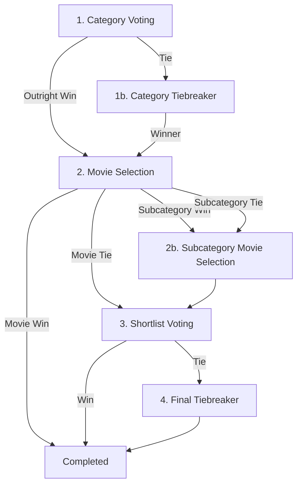

# CLAUDE.md - AI Context & Development Guide

This file provides system context, build/test commands, and architectural workflows for AI assistants working in this repository.

---

## Build & Test Commands

> **Node 22 only.** `better-sqlite3` is a native module tied to Node's ABI;
> another major fails at runtime with `NODE_MODULE_VERSION`, not at install.
> Pinned in `.node-version`, enforced by `engines` + `engine-strict`. After a
> version switch, run `npm rebuild better-sqlite3`.

*   **Run Development Server**: `npm run dev` (starts on port 4000)
*   **Run Tests Once**: `npm run test`
*   **Run Tests in Watch Mode**: `npm run test:watch`
*   **Run Test Coverage**: `npm run test:coverage`
*   **Lint Code**: `npm run lint`
*   **Typecheck**: `npm run typecheck`
*   **Database Backup**: `npm run db:backup`

### Prisma & Database Actions
*   **Generate Prisma Client**: `npx prisma generate` (runs automatically on `npm install`)
*   **Apply DB Migrations**: `npx prisma migrate dev`
*   **Seed Database**: `npx prisma db seed`
*   **Open Prisma Studio**: `npx prisma studio`
*   **Backfill IMDb Metadata**: `npx tsx prisma/backfill-metadata.ts`

### Docker & Deployment Commands
*   **Start Docker Stack**: `docker compose up -d` (starts web app from GHCR on port 4000, Watchtower auto-updater, and cloudflared tunnel)
*   **Stop Docker Stack**: `docker compose down`
*   **View Web App Logs**: `docker compose logs -f web` (includes migrations & seeding checks)
*   **View Watchtower Logs**: `docker compose logs -f watchtower`
*   **View Tunnel Logs**: `docker compose logs -f tunnel`
*   **View Cron Scheduler Logs**: `docker compose logs -f cron`

---

## Technical Stack
*   **Framework**: Next.js (App Router, React 19)
*   **Database**: SQLite (via Prisma ORM)
*   **Styling**: Vanilla CSS (global rules in `src/app/globals.css`, no Tailwind unless requested)
*   **Testing**: Vitest
*   **CI/CD & Container Registry**: GitHub Actions -> GHCR (`ghcr.io/brianyeckley/movie-night:latest`).
    `ci.yml` runs typecheck, lint and tests on pull requests; `docker-publish.yml`
    repeats that gate on pushes to main and only then builds and pushes the image.
*   **Deployment**: Docker / Docker Compose (includes pre-built image, Watchtower auto-updater with `DOCKER_API_VERSION=1.40`, and integrated `cloudflare/cloudflared` tunnel daemon)

---

## Key Directories & File Roles
*   `src/app/page.tsx`: Main dashboard and routing entry point.
*   `src/app/actions/`: Server actions containing mutation logic (e.g., `week.ts`, `voting.ts`).
    Everything exported from a `"use server"` file is a public endpoint, so each
    export must do its own authorization -- see `src/lib/auth.ts`.
*   `src/lib/rounds.ts`: **Single source of truth** for week statuses, their round
    codes, display names and vote limits. Add a status here first; the total
    `Record` types make the build fail until every consumer handles it.
*   `src/lib/round-engine.ts`: The voting state machine. Deliberately outside
    `actions/` so it is not itself a callable endpoint.
*   `src/components/DashboardForms.tsx`: Houses container server components that fetch data for each voting round.
*   `src/components/VotingFormClient.tsx`: Houses interactive client forms for checkbox checking and submitting.
*   `src/components/MovieVoteRow.tsx`: The one movie row every voting round renders.
*   `src/hooks/useVoteSelection.ts`: Selection/submit state shared by those forms.
*   `src/lib/voting-helpers.ts`: Compiles shortlist and tiebreaker movie selections from raw database votes.
*   `src/lib/types.ts`: Prisma-derived shapes for the data the UI renders.

---

## Voting Rounds Flow

A standard voting week progresses through the following statuses in `MovieNightWeek.status`:

### Active Round & Vote Limits
*   **Round 1**: `CATEGORY_VOTING` (Target: Category, Limit: 1 vote)
*   **Round 1b**: `CATEGORY_TIEBREAKER_VOTING` (Target: Category, Limit: Max 2 votes)
*   **Round 2**: `MOVIE_VOTING` (Target: Movie / Subcategory, Limit: Max 2 votes)
*   **Round 2b**: `SUBCATEGORY_VOTING` (Target: Subcategory Movie / Subcategory folder, Limit: Max 3 votes)
    *   *Note: In the event of a tie in Round 2 involving a subcategory and movies, the subcategory folder is shown as a selectable option alongside the individual tied movies.*
*   **Round 3**: `SHORTLIST_VOTING` (Target: Shortlist Movie, Limit: Max 3 votes)
*   **Round 4**: `FINAL_VOTING` (Target: Shortlist Movie, Limit: 1 vote, random draw tiebreak)

### In-Person Week Statuses (`MovieNightWeek.isInPerson === true`)
Vote limits live in `IN_PERSON_ROUNDS` in `src/lib/rounds.ts`, which is what the
server action enforces and the forms render -- update that table, not this list.

*   `IN_PERSON_VOTING` (Round 1: Select up to 3 votes)
*   `IN_PERSON_TIEBREAKER` (Round 1b: Tiebreaker, select up to 4 votes)
*   `IN_PERSON_ROUND_2` (Round 2: Tiebreaker, select exactly 1 vote)
*   `IN_PERSON_ROUND_3` (Round 3: Final tiebreaker, select up to 2 votes)
*   `COMPLETED`
