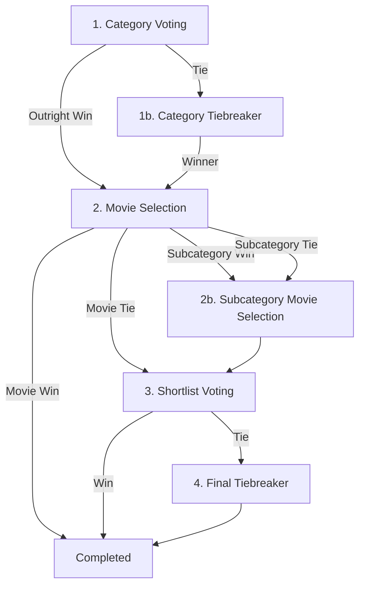

# CLAUDE.md - AI Context & Development Guide

This file provides system context, build/test commands, and architectural workflows for AI assistants working in this repository.

---

## Build & Test Commands

*   **Run Development Server**: `npm run dev` (starts on port 4000)
*   **Run Tests Once**: `npm run test`
*   **Run Tests in Watch Mode**: `npm run test:watch`
*   **Run Test Coverage**: `npm run test:coverage`
*   **Lint Code**: `npm run lint`
*   **Database Backup**: `npm run db:backup`

### Prisma & Database Actions
*   **Generate Prisma Client**: `npx prisma generate` (runs automatically on `npm install`)
*   **Apply DB Migrations**: `npx prisma migrate dev`
*   **Seed Database**: `npx prisma db seed`
*   **Open Prisma Studio**: `npx prisma studio`
*   **Backfill IMDb Metadata**: `npx tsx prisma/backfill-metadata.ts`

### Docker & Deployment Commands
*   **Start Docker Stack**: `docker compose up -d` (starts web app on port 4000 and the cloudflared tunnel)
*   **Stop Docker Stack**: `docker compose down`
*   **View Web App Logs**: `docker compose logs -f web` (includes migrations & seeding checks)
*   **View Tunnel Logs**: `docker compose logs -f tunnel`

---

## Technical Stack
*   **Framework**: Next.js (App Router, React 19)
*   **Database**: SQLite (via Prisma ORM)
*   **Styling**: Vanilla CSS (global rules in `src/app/globals.css`, no Tailwind unless requested)
*   **Testing**: Vitest
*   **Deployment**: Docker / Docker Compose (includes integrated `cloudflare/cloudflared` tunnel daemon)

---

## Key Directories & File Roles
*   `src/app/page.tsx`: Main dashboard and routing entry point.
*   `src/app/actions/`: Server actions containing mutation logic (e.g., `week.ts`, `voting.ts`).
*   `src/components/DashboardForms.tsx`: Houses container server components that fetch data for each voting round.
*   `src/components/VotingFormClient.tsx`: Houses interactive client forms for checkbox checking and submitting.
*   `src/lib/voting-helpers.ts`: Compiles shortlist and tiebreaker movie selections from raw database votes.

---

## Voting Rounds Flow

A standard voting week progresses through the following statuses in `MovieNightWeek.status`:

### Active Round & Vote Limits
*   **Round 1**: `CATEGORY_VOTING` (Target: Category, Limit: 1 vote)
*   **Round 1b**: `CATEGORY_TIEBREAKER_VOTING` (Target: Category, Limit: Max 2 votes)
*   **Round 2**: `MOVIE_VOTING` (Target: Movie / Subcategory, Limit: Max 2 votes)
*   **Round 2b**: `SUBCATEGORY_VOTING` (Target: Subcategory Movie / Subcategory folder, Limit: Max 3 votes)
    *   *Note: In the event of a tie in Round 2 involving a subcategory and movies, the subcategory folder is shown as a selectable option alongside the individual tied movies.*
*   **Round 3**: `SHORTLIST_VOTING` (Target: Shortlist Movie, Limit: Max 3 votes)
*   **Round 4**: `FINAL_VOTING` (Target: Shortlist Movie, Limit: 1 vote, random draw tiebreak)

### In-Person Week Statuses (`MovieNightWeek.isInPerson === true`)
*   `IN_PERSON_VOTING` (Round 1: Select up to 1 vote)
*   `IN_PERSON_TIEBREAKER` (Round 1b: Tiebreaker, select up to 1 vote)
*   `IN_PERSON_ROUND_2` (Round 2: Tiebreaker, select up to 1 vote)
*   `IN_PERSON_ROUND_3` (Round 3: Final tiebreaker, select up to 2 votes)
*   `COMPLETED`
